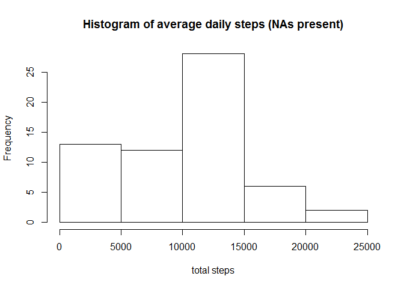

# Activity Monitoring Assignment
Joshua Waxman  
Monday, December 08, 2014  

Required Libraries:


```r
date <- date()
library(dplyr)
```

```
## 
## Attaching package: 'dplyr'
## 
## The following object is masked from 'package:stats':
## 
##     filter
## 
## The following objects are masked from 'package:base':
## 
##     intersect, setdiff, setequal, union
```

```r
library(lattice)
```


##Loading and preprocessing the data
We begin by acquiring the dataset for the Activity Monitoring assignment. The data were acquired at approximately Fri Dec 12 06:22:58 2014 from the following website

<https://d396qusza40orc.cloudfront.net/repdata%2Fdata%2Factivity.zip>

unzip it, and then read using the following code:


```r
download.file(url = "https://d396qusza40orc.cloudfront.net/repdata%2Fdata%2Factivity.zip", destfile = "activity.zip", method = "curl")
```

```
## Warning: running command 'curl
## "https://d396qusza40orc.cloudfront.net/repdata%2Fdata%2Factivity.zip" -o
## "activity.zip"' had status 127
```

```
## Warning in download.file(url =
## "https://d396qusza40orc.cloudfront.net/repdata%2Fdata%2Factivity.zip", :
## download had nonzero exit status
```

```r
unzip("activity.zip")
df <- read.csv("activity.csv")
```

The data look like this:

```r
head(df)
```

```
##   steps       date interval
## 1    NA 2012-10-01        0
## 2    NA 2012-10-01        5
## 3    NA 2012-10-01       10
## 4    NA 2012-10-01       15
## 5    NA 2012-10-01       20
## 6    NA 2012-10-01       25
```

```r
tail(df)
```

```
##       steps       date interval
## 17563    NA 2012-11-30     2330
## 17564    NA 2012-11-30     2335
## 17565    NA 2012-11-30     2340
## 17566    NA 2012-11-30     2345
## 17567    NA 2012-11-30     2350
## 17568    NA 2012-11-30     2355
```

##What is mean total number of steps taken per day?
First, let us generate a histogram of the number of steps taken each day.


```r
steps_by_date <- df %>% group_by(date) %>% summarise(count_steps = sum(steps, na.rm=TRUE))
hist(steps_by_date$count_steps, xlab = "total steps", main="Histogram of average daily steps (NAs present)")
```

 

We then calculate the mean and median total number of steps per day. 


```r
theMean <- mean(steps_by_date$count_steps, na.rm = TRUE)
theMedian <- median(steps_by_date$count_steps, na.rm = TRUE)
```

The mean total number of steps per day is 9354.2295082 and the median total number of steps per day is 10395.

##What is the average daily activity pattern?
Next, we construct a time-series plot of the 5-minute interval (x-axis) and the average number of steps taken, averaged across all days (y-axis).


```r
steps_by_interval <- df %>% group_by(interval) %>% summarise(avg_steps=mean(steps, na.rm = TRUE))
with(steps_by_interval, plot(x=interval, y=avg_steps, type="l", main="Time series -- average steps (across all days)\n taken at each 5 minute interval"))
```

 

```r
max_position <- which(steps_by_interval$avg_steps == max(steps_by_interval$avg_steps) )
max_interval <- steps_by_interval$interval[max_position]
```

Also, the 5-minute interval, on average across all the days in the dataset, which contains the maximum number of steps is this one: 835

##Imputing missing values
We note that there are a number of days/intervals where there are missing values (coded as NA). Since the presence of missing days may introduce bias into some calculations or summaries of the data, we shall take some steps to address this.

First, we shall calculate and report the total number of missing values in the dataset.

There are not any NAs in the date or interval columns, but only the steps column, because we specify the date and interval, and only the number of steps for that time period might or might not exist.

We can calculate the number of NA values as follows:


```r
num_nas <- length(df$steps[is.na(df$steps)])
print(num_nas)
```

```
## [1] 2304
```

Next, we shall devise a strategy for filling in all of the missing values in the dataset. The simple strategy we adopt is, when encountering an NA, to assign the mean across all days for that particular five minute interval.

We do this by finding which rows in the df data frame contain NA and then, for each such row, looking up the mean in the steps_by_interval data frame. We assign those back to the NA rows in the df data frame.


```r
missing_steps <- which(is.na(df$steps))
intervals_of_missing_steps <- df[missing_steps, ]$interval
positions <- which(steps_by_interval$interval == intervals_of_missing_steps)
df_imputed <- df
df_imputed[missing_steps, ]$steps <- steps_by_interval[positions, ]$avg_steps
```

We now repeat the histogram, median, and mean, this time with the NA filled in.


```r
steps_by_date_imputed <- df_imputed %>% group_by(date) %>% summarise(count_steps = sum(steps, na.rm=TRUE))
hist(steps_by_date_imputed$count_steps, xlab = "total steps", main="Histogram of average daily steps (NAs replaced)")
```

 

See how the first two bars of this histogram are level with each other, while in the previous histogram the first bar was slightly higher than the second.

We once again calculate the mean and median total number of steps per day. 


```r
theMeanImputed <- mean(steps_by_date_imputed$count_steps, na.rm = TRUE)
theMedianImputed <- median(steps_by_date_imputed$count_steps, na.rm = TRUE)
```

The mean total number of steps per day (replacing NAs) is 9530.72, which is slightly larger than from 9354.23. The median total number of steps per day is 10439 which is slightly larger than 10395.

Thus,  the impact of imputing missing data on the estimates of the total daily number of steps is to slightly raise those estimates.

##Are there differences in activity patterns between weekdays and weekends?

We now add a factor variable to our imputed data frame, to track whether it is a weekday or weekend day. We decide to define the weekend as Saturday and Sunday.

Then we plot a new time series -- average steps (across all days) taken at each 5 minute interval, for weekends and weekdays:


```r
day_of_week <- weekdays(as.Date(df_imputed$date))
df_imputed$day = rep("weekday", nrow(df_imputed))
df_imputed$day[day_of_week %in% c("Saturday", "Sunday")] = "weekend"
df_imputed$day <- factor(df_imputed$day)

df_imputed_grouped <- group_by(df_imputed, day, interval)
steps_by_interval_imputed <- summarize(df_imputed_grouped, avg_steps=mean(steps))

xyplot(avg_steps ~ interval | day , data=steps_by_interval_imputed, type="l", layout=c(1, 2))
```

 

